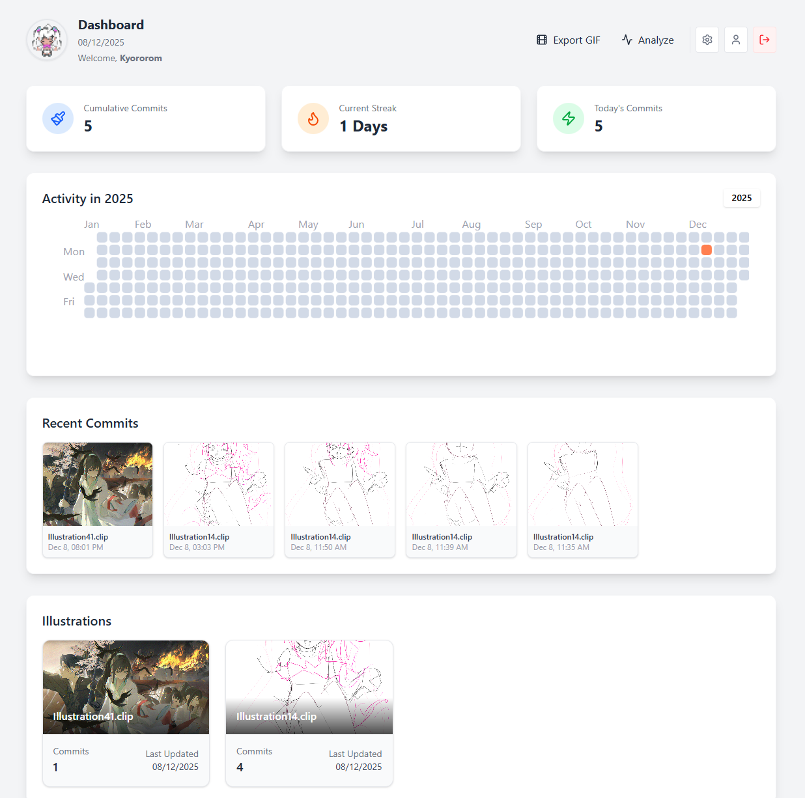
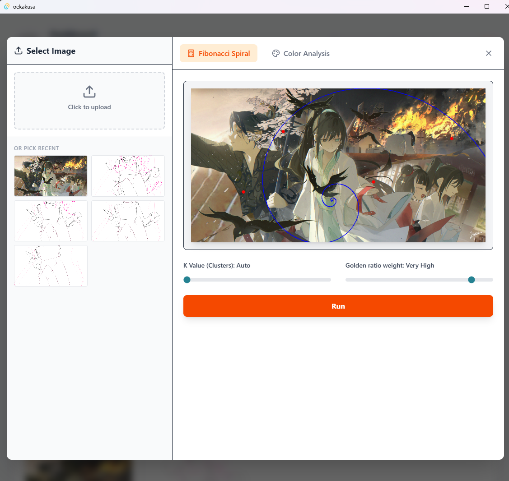
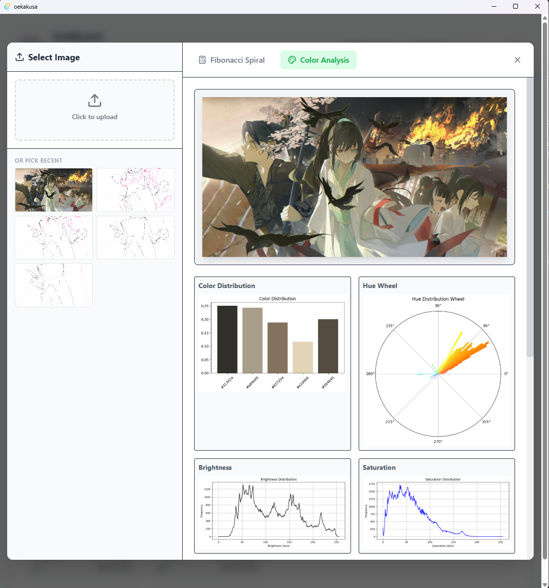

# Oekakusa (お絵描草)

Oekakusa ("Drawing Grass") is a desktop application that tracks your illustration progress in CLIP STUDIO PAINT (`.clip`) and visualizes it as a GitHub-style contribution graph. It turns every save into a commit, helping you maintain motivation and "grow your grass" (make the contribution graph green).





## Features

- **Automatic Tracking**: Automatically watches specified folders for changes in `.clip` files. Every save is detected instantly.
- **Thumbnail Extraction**: Extracts high-quality thumbnails directly from the `.clip` file structure (SQLite database embedded) using a built-in Python script.
- **Contribution Graph**: Visualizes your daily activity (Cumulative commits, Streak, Heatmap) just like GitHub.
- **Illustration History**: View the evolution of your artwork with a timeline gallery for each specific illustration.
- **Cloud Sync**: Built on **Firebase**. Your stats and thumbnails sync across devices (Desktop App & Web Dashboard).
- **GIF Export**: Create a timelapse GIF of your progress from the saved history.
- **Analysis Integration**: (Experimental) Analyze your art for Fibonacci composition and color palettes.

## Tech Stack

### Frontend

- **Framework**: React + TypeScript
- **Build Tool**: Vite
- **Styling**: Tailwind CSS
- **UI**: Lucide React, React Calendar Heatmap

### Backend (Desktop)

- **Core**: Tauri v2 (Rust)
- **Watcher**: Custom Rust implementation using `notify` crate (Debounced & Path-Normalized).

### Cloud & Database

- **Platform**: Firebase
- **DB**: Cloud Firestore
- **Storage**: Cloud Storage for Firebase (Thumbnails)
- **Auth**: Firebase Authentication (Email/Password)

## Download

Download the latest version for Windows from the [Releases Page](../../releases).

Simply unzip and run `oekakusa.exe`.

## Setup & Build

1.  **Clone & Install**:

    ```bash
    git clone https://github.com/yourusername/oekakusa.git
    cd oekakusa
    npm install
    ```

2.  **Environment Variables**:
    Create a `.env` file in the root directory (required for Firebase):

    ```env
    VITE_FIREBASE_API_KEY
    VITE_FIREBASE_AUTH_DOMAIN
    VITE_FIREBASE_PROJECT_ID
    VITE_FIREBASE_STORAGE_BUCKET
    VITE_FIREBASE_MESSAGING_SENDER_ID
    VITE_FIREBASE_APP_ID
    ```

3.  **Run Locally**:

    ```bash
    npm run tauri dev
    ```

4.  **Build Release**:
    To create the `.exe` installer yourself:
    ```bash
    npm run tauri build
    ```

---

## License

[MIT](LICENSE)
